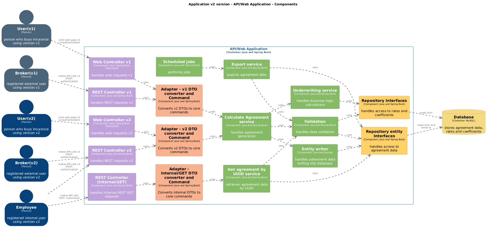
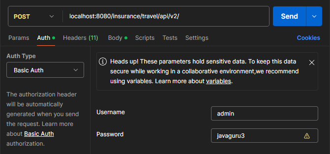

# Insurance Application
This repository contains an insurance calculator application developed during a virtual internship as part of the
**JavaGuru 'Java 2 - Agile Web Development'** course.<br>
<br>
The project was built to apply various technologies in a practical Context while following an Agile development 
approach.<br>
The application is developed with Java Spring Boot and uses Gradle for building and dependency management.

## Overview
The insurance calculator application is a simple web service that calculates insurance premiums based on user
requests. The project focuses on building a robust easily modifiable design, implementing data persistence, REST APIs 
and a simple web interface. The aim was to explore the Spring ecosystem and become familiar with commonly used tools.

Development was done step-by-step in nearly 200 tasks, each addressing either the implementation of a specific
feature or a refactor to improve the codebase. Each task built on the previous work, allowing to observe the
application evolve over time. As the project progressed, some earlier design decisions required adjustment to meet
new requirements, leading to the necessity for refactoring or redesigning parts of the system.

## Key Features
- Spring Boot application, build and dependency management with Gradle.
- Implemented business logic for calculating several types of insurance premiums.
- Version v2 backward compatibility with version v1.
- Secured REST API endpoints for interacting with the application.
- Simple web interface (Thymeleaf) for user interaction.
- Authentication and authorization with Spring Security Basic Auth.
- Data persistence using MySQL database and migrations with Liquibase.
- JAR, publishing and scheduled XML export.

## Good Practices
- Adoption of Hexagonal Architecture Principles for version v2 application design, with an emphasis on decoupling the 
core business logic from external concerns like the user interface.
- Converter (adapter) classes for transferring data between user interface layer and core layer.
- Immutable Data Transfer Objects (DTOs) for data exchange (Java Records).
- SOLID principles for flexibility and maintainability.
- Inversion of Control (IoC) for decoupling object creation and management from business logic.
- Unit, integration, acceptance testing with good coverage, and simple load testing.

## Technologies Used
The project utilizes the following core technologies:
- Java, Spring, Spring Boot, Gradle, JPA, JDBC, ORM, Hibernate, MySQL, H2, Liquibase, JUnit, Mockito, MVC, HTML, 
Thymeleaf, IntelliJ IDEA, Git, GitHub, CI, Lombok, Postman, OpenAPI, logging, Spring-based caching,
scheduled jobs, XML exports, JAR/WAR packaging, publishing, and handling JSON data formats, among other features.

In addition to the core requirements, I explored and incorporated following technologies based on my personal interest:

- Spring Security (Basic Authentication) for REST endpoints, Java Records for DTOs, Parameterized and Dynamic Tests, 
Template Method Pattern, Aspect-Oriented Programming (AspectJ) for logging, Caffeine for caching.

## Project Overall Structure
The codebase consists of two versions of the application, named v1 and v2, each implementing a distinct architectural 
approach. 
- v1: This version is based on a simple layered architecture, where the service layer depends directly on the user 
interface layer. During the development process, new user interface requirements emerged, revealing that the initial 
design lacked the flexibility needed to accommodate these changes without modifying core business logic.

- v2: To address this issue, v2 was developed with elements of hexagonal (ports and adapters) architecture. In this 
design, the core business logic is decoupled from the user interface layer by using converter classes. Data is 
transferred between the interface layer and the core logic via converter classes, which transform the incoming data into 
immutable Data Transfer Objects (DTOs) for use within the core layer, and then convert the core layer’s output back 
into a format suitable for the user interface.


- Communication between different core modules is done through abstract interfaces, ensuring loose coupling between 
different parts of the core logic.
- Communication between the core layer and the user interface layer is also done through abstract interfaces, maintaining 
separation between the core business logic and the user interface.
- Communication between the core layer and the database is managed via repository interfaces with default Spring Data
JPA implementations.

The v2 version is designed to ensure backward compatibility with v1, allowing to use both versions of user interface.

## Version v2 Model with C4 Component Diagram
<br>

## Future Perspectives
The course contains also the second part I am enrolled in, which incorporates technologies such as microservices, 
Docker, RabbitMQ, Elastic, Prometheus, Grafana and other technologies.

Additionally, I am planning to update outdated or deprecated dependencies, including:
- Migration from JDK 17 to JDK 21.
- Migration from Spring Boot 2.7.5. to Spring Boot 3.3.1.
- Migration from java.util.Date to java.time.
Also:
- Externalize environment variables and test user credentials.
- Add Spring Profiles for different environments.

## How to Run the Project Locally
### Important note:
- `v1` module is initial (historical) version that is kept to demonstrate the evolution of the project.
- `v2` module is the refactored and updated version that supports both v1 and v2 user interfaces.

You should run `v2` module.

### Prerequisites
- Java Development Kit (JDK) 17 – it can be downloaded either within IDE (like IntelliJ IDEA, Eclipse) or manually - 
[Download JDK 17 Here](https://aws.amazon.com/corretto/?filtered-posts.sort-by=item.additionalFields.createdDate&filtered-posts.sort-order=desc)
- Gradle - only if you are running the project outside an IDE that handles Gradle automatically – 
[Download Gradle Here](https://gradle.org/install/)
<br>
The project is configured to use an in-memory H2 database by default, requiring no additional setup.<br> 
If you prefer using MySQL, it is also supported. For this, install and run MySQL 8.3 (optionally, use MySQL Workbench). 
To switch to MySQL, update the v2 module's `application.properties` by uncommenting the MySQL settings and commenting out 
the H2 settings. You will also need to configure the database and user credentials in your MySQL instance as specified 
in the `application.properties`.

### Steps to Run:
1. Clone the repository and navigate to the project directory:<br>
`git clone https://github.com/ElinaZoldnere/Insurance-Application-Part-1.git` <br>
`cd Insurance-Application-Part-1`

2. Open the project in your IDE (e.g., IntelliJ IDEA or Eclipse).

3. Run the application:<br>
In your IDE, locate the `InsuranceApplication` main class in the `v2` module and run it.

4. Access the application:
- REST API/POST v1: http://localhost:8080/insurance/travel/api/v1/
- REST API/POST v2: http://localhost:8080/insurance/travel/api/v2/
- REST API/GET:     http://localhost:8080/insurance/travel/api/internal/agreement/{agreement-uuid-here}
- Web Interface v1: http://localhost:8080/insurance/travel/web/v1/
- Web Interface v2: http://localhost:8080/insurance/travel/web/v2/

REST API endpoints you can test via https://www.postman.com/ or Postman app on your local machine.<br>
As endpoints are secured with Basic Authentication, you have to select `Basic Auth` and provide the username and 
password in the request. Username: `admin` and password: `javaguru3` will work for all REST endpoints.<br>

<br>
<br>
Example JSON for testing REST API/POST v1 at http://localhost:8080/insurance/travel/api/v1/
```json
{
  "personFirstName": "Jānis",
  "personLastName": "Bērziņš",
  "personalCode": "123456-12345",
  "personBirthDate": "1990-01-01",
  "agreementDateFrom": "2025-03-10",
  "agreementDateTo": "2025-03-11",
  "selectedRisks": [
    "TRAVEL_MEDICAL",
    "TRAVEL_LOSS_BAGGAGE"
  ],
  "country": "SPAIN",
  "medicalRiskLimitLevel": "LEVEL_15000"
}
```
Example JSON for testing REST API/POST at http://localhost:8080/insurance/travel/api/v2/
```json
{
  "agreementDateFrom": "2025-03-10",
  "agreementDateTo": "2025-03-11",
  "selectedRisks": ["TRAVEL_MEDICAL"],
  "country": "SPAIN",
  "persons": [
    {
      "personFirstName": "Jānis",
      "personLastName": "Bērziņš",
      "personalCode": "123456-12345",
      "personBirthDate": "1990-01-01",
      "medicalRiskLimitLevel": "LEVEL_15000"
    },
    {
      "personFirstName": "Kārlis",
      "personLastName": "Krūmiņš",
      "personalCode": "234567-23456",
      "personBirthDate": "1989-01-01",
      "medicalRiskLimitLevel": "LEVEL_15000"
    }
  ]
}
```
Please, take into account, the application supports limited number of countries, risk types and limit levels.<br>
Some of the values you can use for testing:<br>
Countries: "LATVIA", "SPAIN", "JAPAN".<br>
Risk types: "TRAVEL_MEDICAL", "TRAVEL_CANCELLATION".<br>
Medical risk limit levels: "LEVEL_5000", "LEVEL_10000", "LEVEL_15000".<br>
<br>
After performing at least one successful request, you can check the results in the H2 Console. Picking a valid agreement
UUID from the table agreements, you can test the REST API/GET endpoint providing the UUID in the URL.
- H2 Console: http://localhost:8080/h2-console/ (username: test, password: test)
- REST API/GET:     http://localhost:8080/insurance/travel/api/internal/agreement/{agreement-uuid-here}

The web interface can be tested filling in the form fields and submitting the request. No authentication required.<br> 
- Web Interface v1: http://localhost:8080/insurance/travel/web/v1/
- Web Interface v2: http://localhost:8080/insurance/travel/web/v2/
