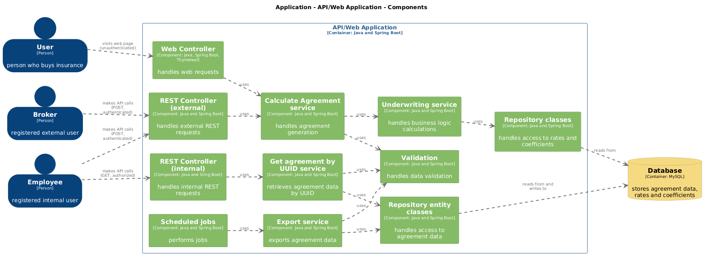

# Insurance Application
This repository contains an insurance calculator application developed during a virtual internship as part of the
**JavaGuru 'Java 2 - Agile Web Development'** course. 
 
The project was built to apply various technologies in a practical
context while following an Agile development approach. 
The application is developed with Java Spring Boot and uses Gradle for building and dependency management.

## Overview
The insurance calculator application is a simple web service that calculates insurance premiums based on user
requests. The project focuses on building a robust easily modifiable design by following the principles of hexagonal
architecture, implementing data persistence, REST APIs and a simple web interface. The aim was to explore the Spring
ecosystem and become familiar with commonly used tools.

Development was done step-by-step in nearly 200 tasks, each addressing either the implementation of a specific
feature or a refactor to improve the codebase. Each task built on the previous work, allowing to observe the
application evolve over time. As the project progressed, some earlier design decisions required adjustment to meet
new requirements, leading to the necessity for refactoring or redesigning parts of the system.

## Technologies Used
The project utilizes the following core technologies:

- Java, Spring, & Spring Boot for the backend development.
- Gradle for dependency management and builds.
- Hexagonal Architecture and Inversion of Control (IoC) for core application design.
- REST APIs to handle communication between the client or users and server.
- JPA, JDBC, ORM, & Hibernate for data persistence and database interactions.
- MySQL & H2 databases for data storage.
- JUnit & Mockito for testing the application’s functionality.
- MVC, HTML, & Thymeleaf for rendering the web interface.
- Other tools - IntelliJ IDEA as the development environment, Liquibase for database migrations, Git and GitHub for
  version control, Continuous Integration (CI) setup, Lombok to reduce boilerplate code, Postman and OpenAPI for API
  testing.
- Project also incorporates unit, integration, acceptance and simple load testing, logging, Spring-based caching,
  scheduled jobs, XML exports, JAR/WAR packaging, publishing, and handling JSON data formats,a mong other features.

## Additional Features
In addition to the core requirements, I added the following features to the project based on my personal interest:

- Spring Security (Basic Authentication) for securing REST endpoints.
- Java Records to create immutable Data Transfer Objects (DTOs).
- Parameterized and Dynamic Tests to increase flexibility and coverage in testing.
- Template Method Pattern for better code organization where applicable.
- Aspect-Oriented Programming (AspectJ) for logging purposes.
- Caching with Caffeine to improve caching performance.

## Project Model with C4 Component Diagram
